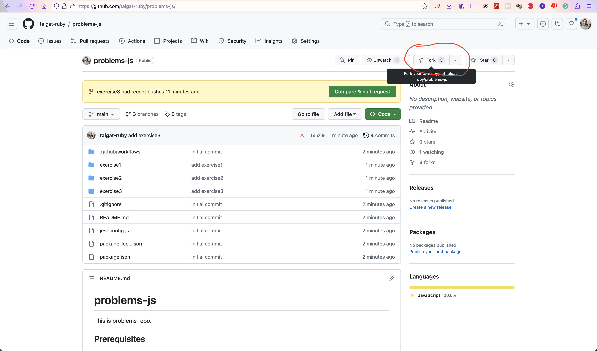

# problems-js

This is problems repo.

## Prerequisites

You will need:

* [git](https://git-scm.com/)
* [NodeJS](https://nodejs.org) (npm come with node js)

Using [jest](https://jestjs.io/) as a testing lib.

## Start

1. Fork repo.



2. Clone forked repo. Use ssh because you will need to push.
3. Install all dependencies.

```shell
npm install
```

4. Solve problems and test if they are valid.

```shell
npm test
```

## Update

First need setup remote repo for update. You need to do that **once**:

```shell
git remote add upstream git@github.com:talgat-ruby/problems-js.git
git remote set-url --push upstream DISABLE
```

Now any time you need to update you can do:

```shell
git pull upstream main
```

## Test

In order to run specific exercise (for example `exercise2`):

```shell
npm test ./exercise2/..
```

Or specific problem (for example `exercise3/problem5`):

```shell
npm test ./exercise3/problem5/..
```