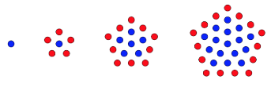

# Problem 3

Write a function that takes a positive integer `num` and calculates how many dots exist in a pentagonal shape around the
center dot on the Nth iteration.

In the image below you can see the first iteration is only a single dot. On the second, there are 6 dots. On the third,
there are 16 dots, and on the fourth there are 31 dots.



Return the number of dots that exist in the whole pentagon on the _Nth_ iteration.

```js
console.log(pentagonal(1)) // 1

console.log(pentagonal(2)) // 6

console.log(pentagonal(3)) // 16

console.log(pentagonal(8)) // 141
```